# 🏠 RentEase

RentEase is a modern and responsive rental management website developed as part of the Unified Mentor Internship Program. It helps users explore rental properties through a clean, simple, and user-friendly interface.

## 🚀 Live Demo

https://unifiedmentor-rentease.netlify.app/

## 📂 GitHub Repository

https://github.com/smritiy935-web/RentEase

## 📌 Project Overview

RentEase is designed to simplify the process of browsing rental properties by providing an organized and responsive platform that works seamlessly across multiple devices.

<p align="center">
  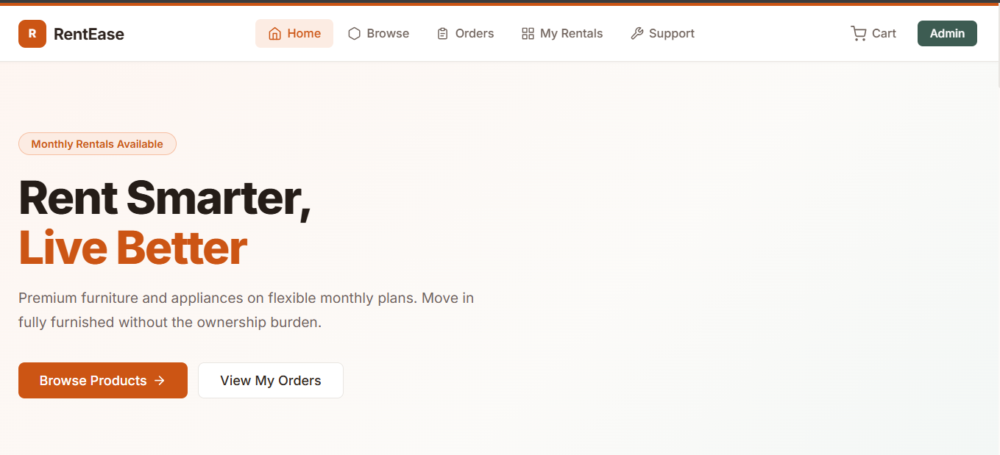
</p>
<p align="center">
  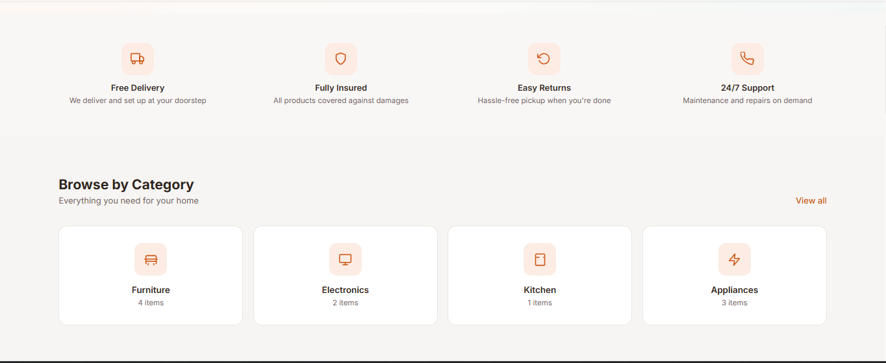
</p>
<p align="center">
  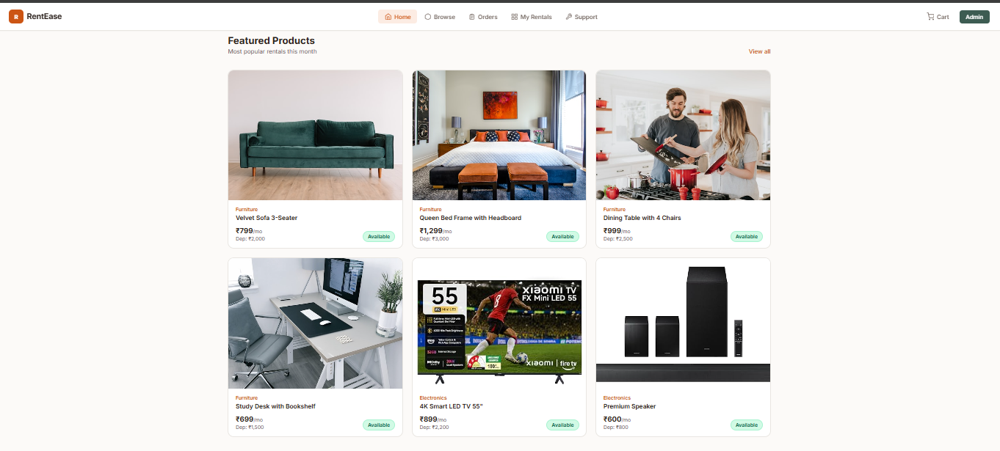
</p>
<p align="center">
  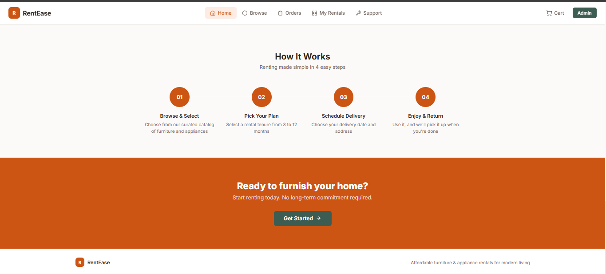
</p>
<p align="center">
  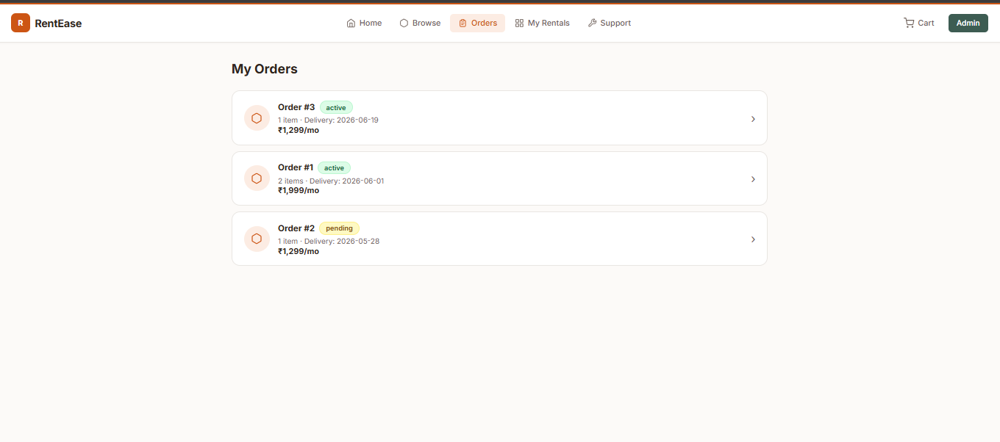
</p>
<p align="center">
  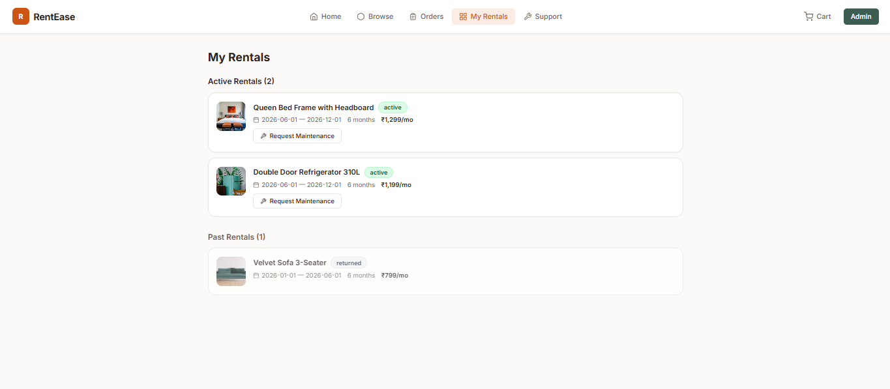
</p>
<p align="center">
  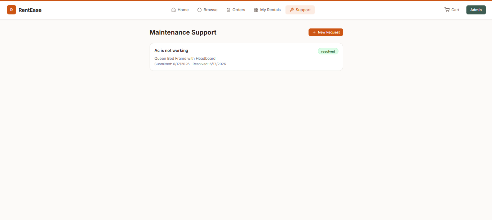
</p>
<p align="center">
  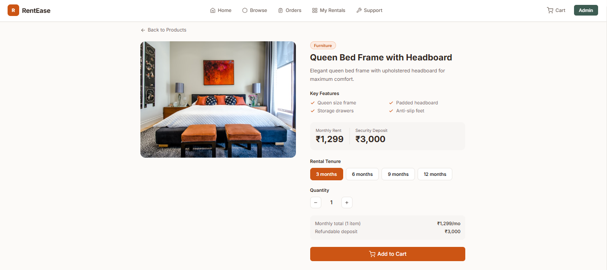
</p>
<p align="center">
  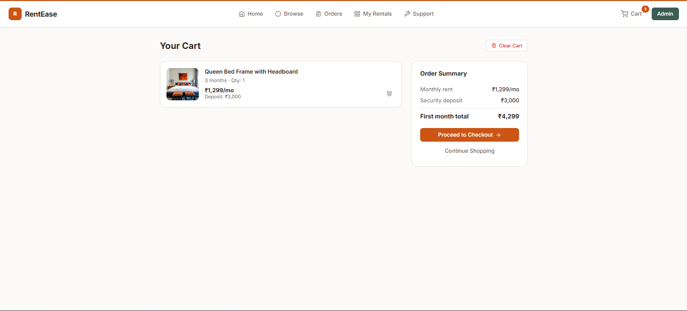
</p>
<p align="center">
  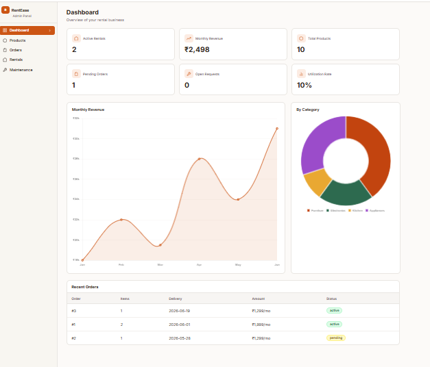
</p>
<p align="center">
  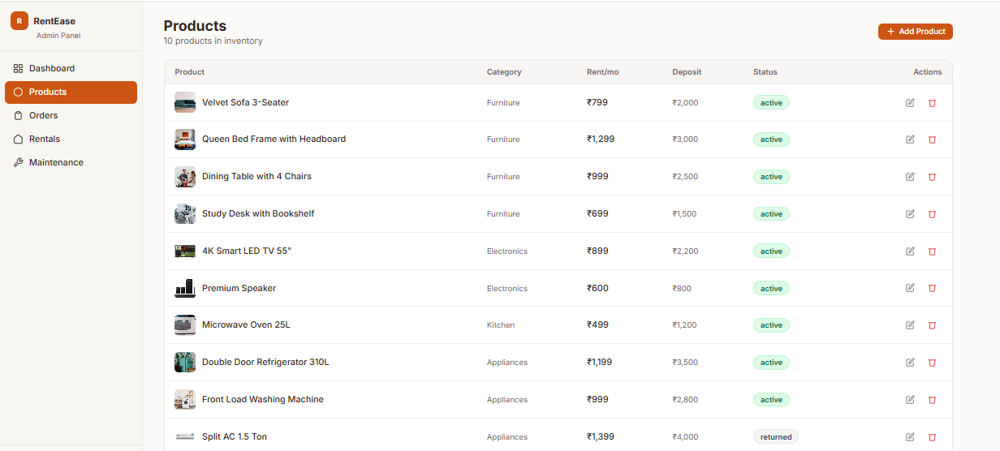
</p>
<p align="center">
  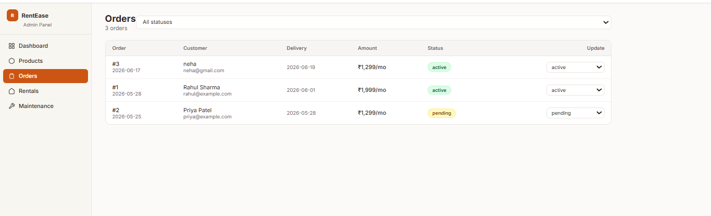
</p>
<p align="center">
  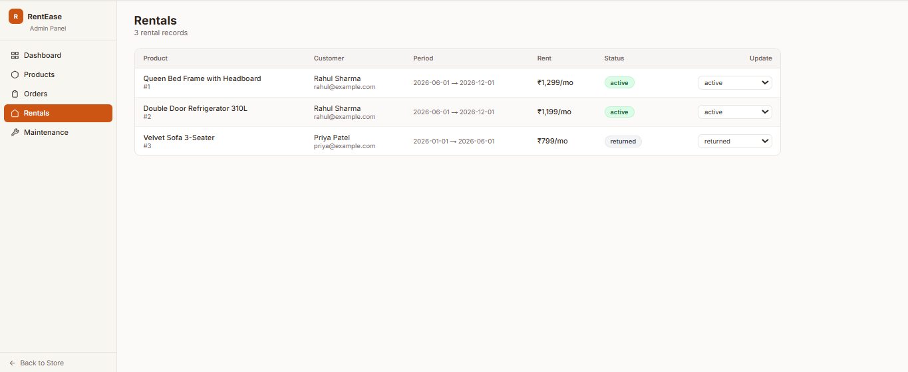
</p>
<p align="center">
  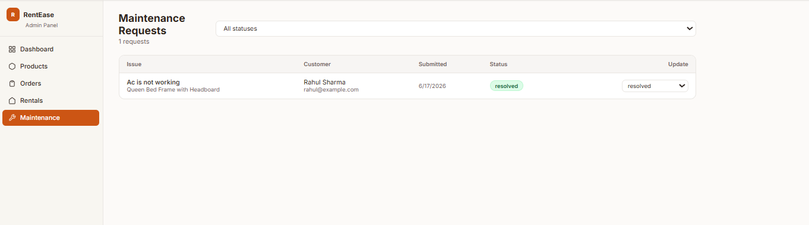
</p>

## ✨ Features

* Responsive design
* Modern user interface
* Property listing section
* User-friendly navigation
* Search functionality
* Mobile, tablet, laptop, and TV support
* Clean and professional layout

## 🛠️ Technologies Used

* HTML5
* CSS3
* JavaScript
* GitHub
* Netlify

## 📱 Responsive Support

* 📱 Mobile (320px - 480px)
* 📲 Tablet (768px - 1024px)
* 💻 Laptop (1024px - 1440px)
* 📺 TV / Large Screens (1920px and above)

## ⚙️ Installation

1. Clone the repository

```bash
git clone https://github.com/smritiy935-web/RentEase.git
```

2. Open the project folder.

3. Run the project using a browser or a local server.

## 🎯 Learning Outcomes

* Responsive Web Design
* CSS Flexbox & Grid
* Frontend Development
* GitHub Version Control
* Project Deployment

## 🔮 Future Enhancements

* User Authentication
* Advanced Search Filters
* Booking System
* Admin Dashboard
* Payment Integration

## 👩‍💻 Developed For

Unified Mentor Internship Program

## 📧 Author

Smriti Yadav
